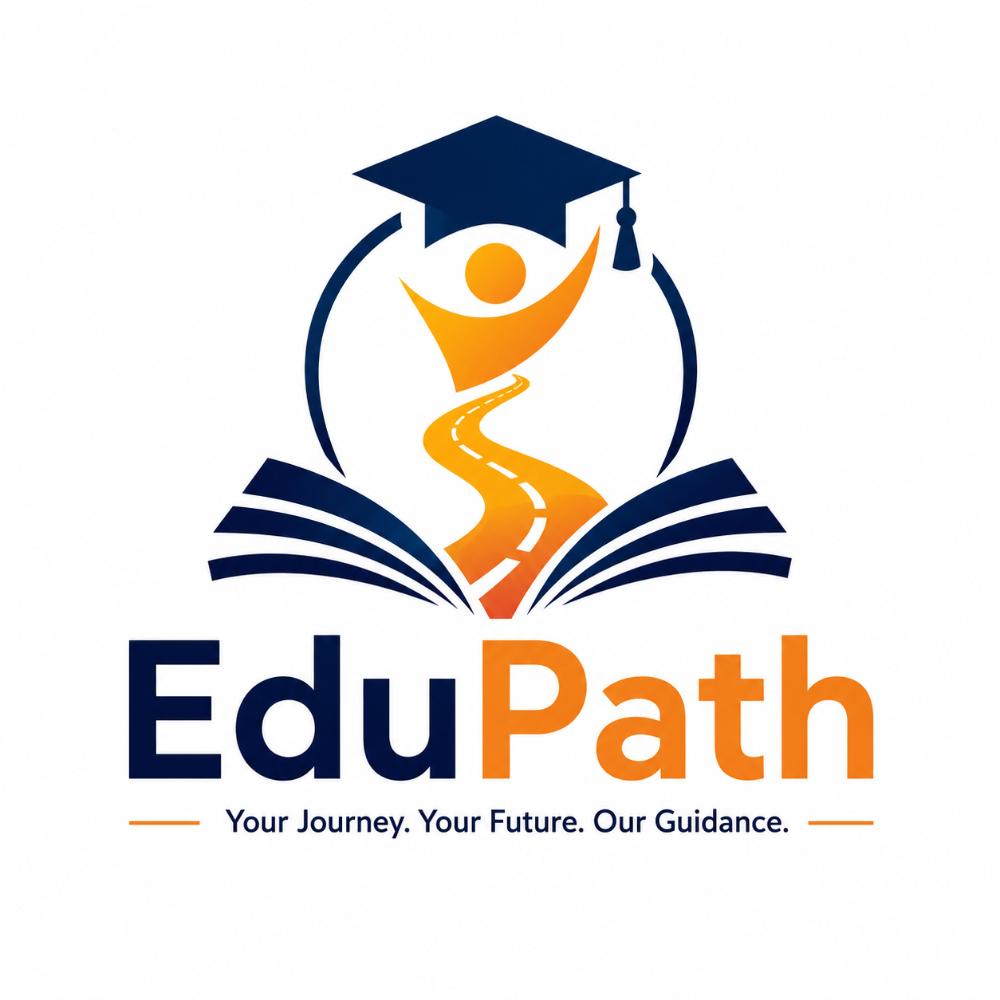

````md
<div align="center">



<br/>

# EduPath

### 🚀 A Personalised Education Navigator for First-Generation College Students in India

<p align="center">
  <strong>
    Helping students discover scholarships, career opportunities, mentors, and learning resources through one intelligent personalized roadmap.
  </strong>
</p>

<br/>

<p align="center">
  
</p>

<br/>

<p align="center">
  <i>
    “Google gives them 10 lakh results. We give them one roadmap.”
  </i>
</p>

<br/>

<p align="center">
  
  
  
  
  
</p>

<br/>

<p align="center">
  
  
</p>

</div>

---

# 🌍 Problem Statement

Millions of first-generation college students in India struggle not because of lack of talent, but because of lack of guidance.

Students often do not know:
- Which scholarships they qualify for
- What entrance exams they should prepare for
- Where to access free learning resources
- How to connect with mentors

Existing platforms are fragmented, overwhelming, and not personalized.

EduPath solves this by generating a **single personalized roadmap** tailored to every student.

---

# 🎯 Product Vision

EduPath aims to become a digital educational guidance ecosystem designed specifically for students who lack access to proper mentorship, career counseling, and educational awareness.

The platform centralizes:
- Scholarships
- Entrance Exams
- Mentorship Opportunities
- Curated Learning Resources

into one accessible and easy-to-understand platform.

Our mission is to bridge the educational opportunity gap using technology.

---

# ✨ Features

## 🎓 Personalized Student Dashboard
- Scholarship recommendations
- Exam timelines
- Mentor suggestions
- Curated learning resources
- Progress tracking

---

## 📚 Scholarship Finder
Smart filtering based on:
- Category (BC/OBC/SC/ST/General)
- Financial background
- Educational stream
- State
- Career interests

Students receive only the scholarships relevant to them.

---

## 🗓 Exam Calendar
Personalized entrance exam recommendations with:
- Registration dates
- Deadlines
- Exam schedules
- Career relevance

---

## 🤝 Mentor Connect
Connect with:
- Alumni
- Senior students
- Industry mentors
- First-generation achievers

---

## 🌐 Free Learning Resources
Curated educational resources from:
- NPTEL
- SWAYAM
- Khan Academy
- Government educational portals

---

# 🖼 Platform Screenshots

## 🏠 Landing Page

> Save screenshot as:
```txt
landing-page.png
````

```md

```

---

## 📊 Student Dashboard

> Save screenshot as:

```txt
dashboard.png
```

```md

```

---

## 🎓 Scholarship Recommendations

> Save screenshot as:

```txt
scholarships.png
```

```md

```

---

## 🤝 Mentor Connect

> Save screenshot as:

```txt
mentors.png
```

```md

```

---

## 📚 Learning Resources

> Save screenshot as:

```txt
resources.png
```

```md

```

---

# 🛠 Tech Stack

| Layer            | Technology                     |
| ---------------- | ------------------------------ |
| Frontend         | React 19 + Vite + Tailwind CSS |
| Backend          | Express.js                     |
| Database         | PostgreSQL                     |
| ORM              | Drizzle ORM                    |
| Authentication   | Clerk                          |
| Validation       | Zod                            |
| API Architecture | OpenAPI + Orval                |
| Language         | TypeScript                     |
| Package Manager  | pnpm                           |

---

# 🏗 Architecture Overview

```txt
Frontend (React + Vite)
        ↓
Express API Server
        ↓
PostgreSQL Database
        ↓
Personalized Recommendation Engine
```

EduPath follows a scalable modular architecture ensuring maintainability, performance, and future extensibility.

---

# 🧠 Personalization Engine

The recommendation system dynamically filters:

* Scholarships
* Exams
* Resources
* Mentors

based on:

* Educational stream
* State
* Student category
* Financial background
* Career goals
* Academic year

This creates a highly personalized educational roadmap for every student.

---

# 🔐 Security & Authentication

Authentication is securely handled using Clerk authentication services.

Features include:

* Secure session management
* Protected routes
* Authenticated APIs
* User profile authorization

---

# 📱 Accessibility & UX

EduPath focuses heavily on accessibility and usability.

UI goals:

* Beginner-friendly navigation
* Clean layouts
* Mobile responsiveness
* High readability
* Student-focused design
* Minimal learning curve

---

# 🚀 Future Roadmap

* AI-powered mentor chatbot
* Regional language support
* Resume builder
* Mobile application
* AI career recommendation engine
* Internship recommendations
* Scholarship prediction system

---

# ⚡ Local Setup

## Clone Repository

```bash
git clone https://github.com/your-username/edupath.git
cd edupath
```

---

## Install Dependencies

```bash
pnpm install
```

---

## Run Frontend

```bash
pnpm --filter @workspace/edupath run dev
```

---

## Run Backend

```bash
pnpm --filter @workspace/api-server run dev
```

---

# 🔑 Environment Variables

```env
DATABASE_URL=

CLERK_PUBLISHABLE_KEY=
CLERK_SECRET_KEY=

VITE_CLERK_PUBLISHABLE_KEY=
```

---

# 📂 Project Structure

```txt
edupath/
├── artifacts/
│   ├── edupath/        # Frontend
│   └── api-server/     # Backend
├── lib/
│   ├── db/
│   ├── api-spec/
│   ├── api-client-react/
│   └── api-zod/
├── scripts/
└── package.json
```

---

# 🌱 SDG Alignment

## 🎓 SDG 4 — Quality Education

Providing equal access to educational opportunities and guidance.

## ⚖️ SDG 10 — Reduced Inequalities

Bridging the information gap for underprivileged and first-generation students.

---

# 🏆 Repository Highlights

✅ Full-stack architecture
✅ Type-safe APIs
✅ Modern responsive UI
✅ Personalized recommendation engine
✅ Scalable modular structure
✅ Production-ready development workflow

---

# 👨‍💻 Team

Built with passion to empower students and bridge educational inequality through technology.

---

# 📜 License

MIT License

```
```
